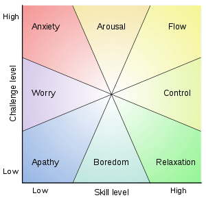

<!-- 
*   Empathy Totems
*   Design Document 
*   Luis Cielak
*   2013-05-02
-->

## Empathy Totems

### Design Document

#### Abstract

<!-- Abstract: Why does the design exists? -->

This project investigates how people can gain a better understanding of human emotions by interacting with data systems as part of their environment.

In everyday life we receive and emit information rooted to our internal emotional network. Often times our expression of these subconscious emotions is abstract, and has little or no value when trying to remediate heated relationship arguments.

It is only after we have a deep understanding of our own emotions that we can reach a certain level of empathy. Empathy is seeing the world through other people's eyes. This is an important step in the path of accomplishing long-lasting human relationships.

#### Need/Opportunity

Everyone feels, happy, angry, anxious and depressed sometimes. Paying attention on how we feel by using the tools available to us can help us grow as individuals and lead us to become happier human beings.

In order to achieve this, there is a need for people to learn how to notice and accept up and down mood patterns. Welcome emotions instead of burying them. Modify their environment to minimize well-being impact.

By tracking emotion data we are able to see changes day to day, and week by week. Encounter patterns and discover behaviors. When sharing emotion data we achieve a level of connectedness and a sense of community that improves the self-esteem.

#### Market Research

"Depression affects about 121 million people worldwide, with many more going undiagnosed, and is the leading cause of disability. Anxiety disorders touch 16% of people globally at some point in their lives." [Ashford]

By utilizing the tools available to us in this modern world we can create means of tracking, understanding, and expressing ourselves more effectively. People who live with Bipolar Disorder use mood tracking methodologies to understand, mitigate, and decrease their mood swings.

The increased presence of mood tracking applications and physical devices such as Withings' body scale, Nike's fuel band, and Fitbit's step-tracker, is an indication of how the market for connected objects is unfolding.

#### Design Description

The purpose of the Empathy Totem system is to collect, track and display emotion data. The mission of the Empathy Totem system is to enable people to understand, share, and increase their level of empathy to one another. This is achieved within the system's feedback loop below.

Empathy Totem system feedback loop:
:
1. Self-actualization of current emotional climate
2. Understanding and communication of our own emotional stream
3. Recognition of external emotions experienced by others around us
4. Relate ourselves to the feelings of others and provide compassion

### Design Features

The Empathy Totem systems consists of two parts: 1) a mobile application for data entry, and 2) a physical structure hosting a multi-color LED as the system's output.

The data is entered through a web-based mobile application representing the nine different emotional zones based on Mihaly Csikszentmihalyi research on 'flow.' This data is interpreted by a ratio correlating challenge degree to skill level. The system output consists of a mystical totem serving as a visual representation of a person's empathy rate. The colors correlate to Csikszentmihalyi's research diagram below.

The data received and interpreted by an Arduino micro-controller located inside the totem. The data is represented by an LED that constantly fluctuates through multiple color patters correlated to the user's historical and current emotion data. This enables people to increase their emotional awareness level while communicating it across. The totem's physical structure acts as an omnipresent reminder of a person's emotional climate.

 

### Design Components

<!-- Features: Hardware -->
Hardware:
:
1 Arduino Uno micro-controller  
4 Wires  
1 Breadboard  
1 RGB LED  
3 Resistors  

<!-- Features: Software -->
Software:
:
Arduino  
Processing  
LAMP stack server 

<!-- Features: Software Functions -->
Functions:
: 
-Input emotion data from a mobile device  
-Store emotion entries for further analysis  
-Send emotion data to an Arduino microcontroller  
-Receive emotion data from server  
-Interpret emotion data and convert to empathy rate  
-Represent empathy rate by using color, form, shape, and texture  

<!-- Diagrams -->
####  Diagrams

Data Flow:
:
Emotion &rarr; Emotion Rate &rarr; Empathy Rate &rarr; Empathy Glow

Application Stack:
:
Linux &rarr; Apache &rarr; MySQL &rarr; PHP &rarr; Application

Network Topology:
:
Application &rarr; Web Server &rarr; Processing &rarr; Arduino

<!-- Conclusion -->

#### Concluding Remarks

<!-- Personal postmortem: -->

I need to do more research on available mood tracking studies such as PANAA, PONS, ESM in order to find a more adequate methodology for entering emotion data. My knowledge on human behavior is limited, so I need to do more research on human emotional patterns and happiness for a proper tracking system to be put in place.

Challenges:
: 
-Lack of well-designed mood tracking studies  
-Scientists disagree on fundamental questions on whether we can experience more than one mood at the time, or whether we all experience emotions the same way  
-Extreme moods may interfere with the tracking  
-Sharing our constant stream of emotions puts us on a very vulnerable state  

Next versions:
:  
-Wireless functionality over Bluetooth or WiFi  
-Multiple-user support  
-Dynamic tool for 3D printing customizable totem structures

- - -

#### Sources

Beyond Boredom and Anxiety: Experiencing Flow in Work and Play
:   Mihaly Csikszentmihalyi

Quantified Self: Get your mood on
:   Rain Ashford  
    Robin Barooah  
    http://quantifiedself.com/2012/12/get-your-mood-on-part-1/

- - -

- - -

## Press Pack

Empathy Totems

The world's first smart totem to track, analyze and represent emotion data.

Let's improve the quality of human lifeform.

##### Content

- Struggles of an everyday life
- The product
- Product features
- Photos
- About

##### Struggles of an everyday life

<!-- [Quotes, paradoxes and existentialist goodies here] -->

Depression affects about 121 million people worldwide, with many more going undiagnosed, and is the leading cause of disability. Anxiety disorders touch 16% of people globally at point in their lives. [Ashford]

##### The Product

The world's first smart totem to track, analyze and represent emotion data.

<!-- For a happier life :) -->

*For happier humans :)*

- First totem with human emotion rate monitoring
- High accuracy happiness tracking based on the Experience Sampling Method (ESM)
- Free app to monitor, visualize, and understand your emotional patterns
- Automatic upload readings over Bluetooth

The human emotion tracking totem

- Emotions and feelings tracking
- Empathy levels measurement and analysis
- Openness in communication channels with loved ones
- Wireless sync via Bluetooth

##### Product Features

- Data input mobile app for constant and accurate data gathering.
- Data entry implementation based on the Experience Sampling Method (ESM), an electronic paging approach to study happiness. [Hektner, Csikszentmihalyi]
- Automatic data synchronization. Constant and up-to-date empathy rate visual representation.
- Seamless connectivity. Bluetooth for easy setup and hassle-free data transfers.

##### Photos

##### About

- - -

- - -
